# Daily Expense Tracker

A modern, feature-rich daily expense tracking application built with Flutter and Firebase. This app allows users to easily log expenses, track budgets, manage frequent favorites, and monitor spending across different categories. 

https://github.com/user-attachments/assets/b75a3476-487e-4815-a954-03fd795977b7

## 📸 Screenshots

### Key Screens
| Dashboard | Log Expense | Expense Detail |
| :---: | :---: | :---: |
| 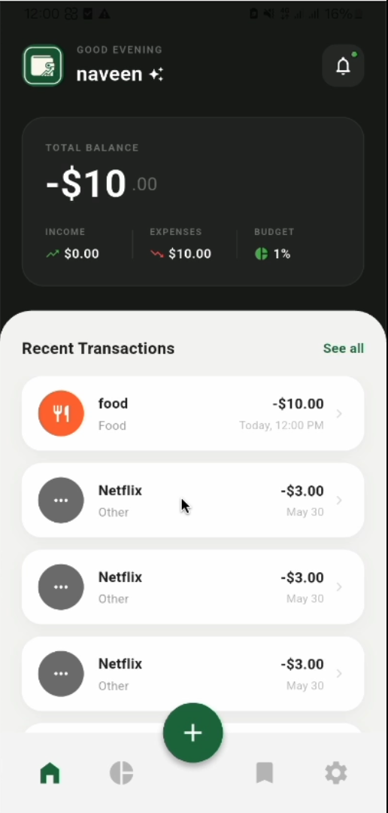 | 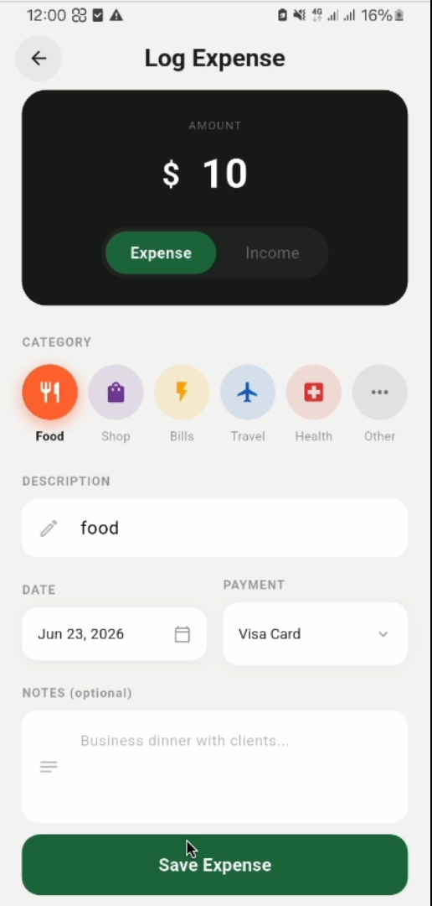 | 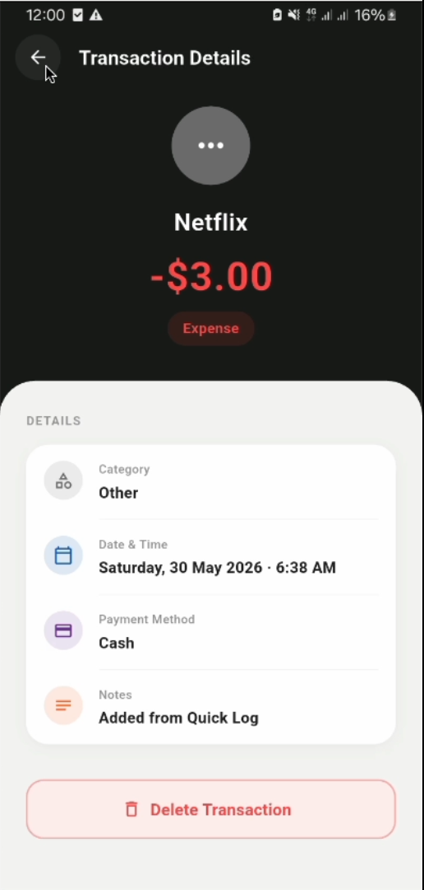 |

| Favorites | Currency Rates | Settings (Dark) |
| :---: | :---: | :---: |
| 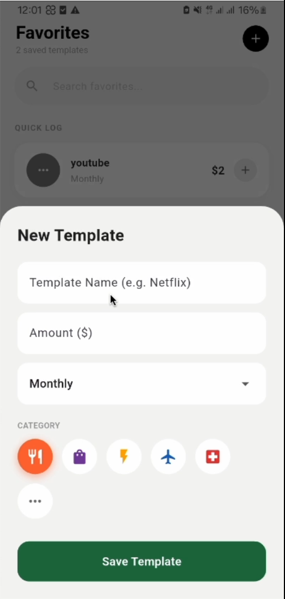 | 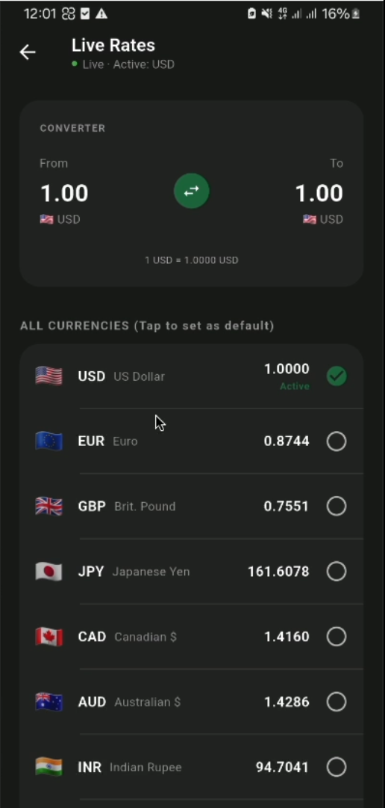 | 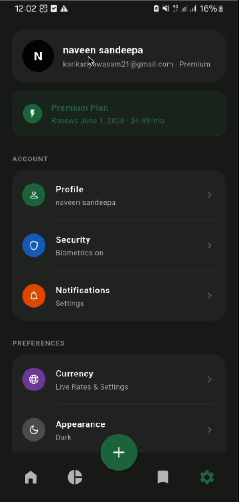 |

<details>
<summary><b>View More Screenshots & Quick Highlight Reel</b></summary>
<br>

| Empty Dashboard | Dashboard (Income) | Dashboard (LKR) |
| :---: | :---: | :---: |
| 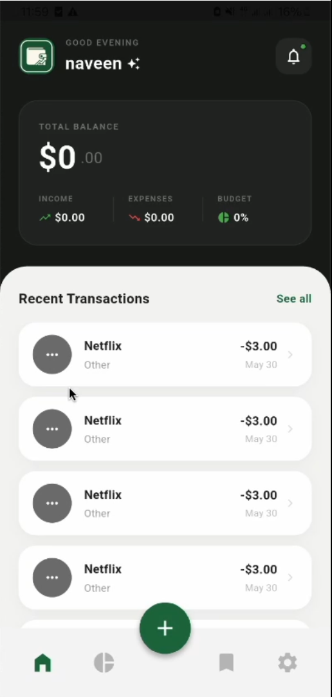 | 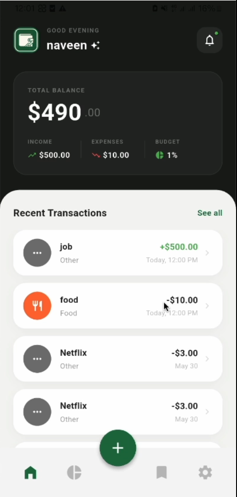 | 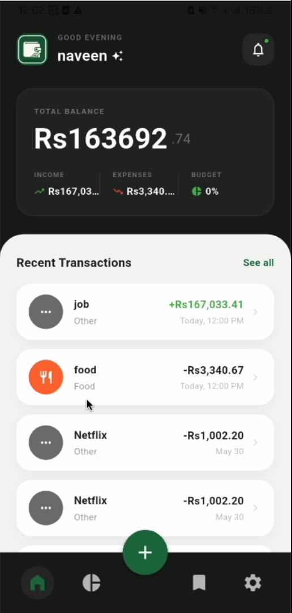 |

| Log Income | Settings (Light) | |
| :---: | :---: | :---: |
| 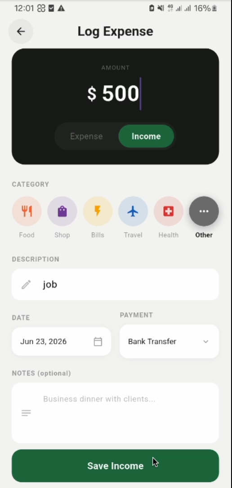 | 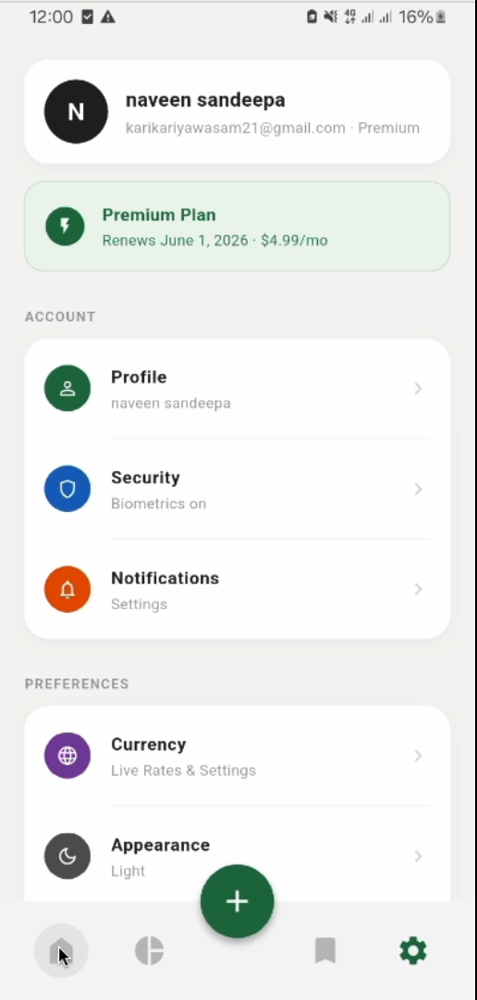 | |

<br>

**Quick Highlight Reel**

https://github.com/user-attachments/assets/2e0b46d5-9c4e-4eb8-90ab-63e0ee66c39e

</details>
## ✨ Features

- **User Authentication:** Secure email/password login and sign up.
- **Biometric Lock:** Secure your app with fingerprint or FaceID authentication via `local_auth`.
- **Expense Logging:** Quickly add expenses with amount, category, payment method, and notes.
- **Favorites:** Save frequent expenses (like coffee or subscriptions) to log them quickly in the future.
- **Budget Tracking:** Set custom budgets per category and monitor your spending limits visually.
- **Live Currency Conversion:** Support for multiple currencies (USD, LKR, EUR, GBP, AUD, INR) fetching live rates from [Exchange Rate API](https://open.er-api.com).
- **Data Export:** Export your entire expense history directly to a CSV file.
- **Customizable Appearance:** Toggle between Light and Dark themes to suit your preference.

## 🛠 Tech Stack

- **Framework:** Flutter / Dart
- **Backend Services:** Firebase Authentication, Cloud Firestore
- **State Management:** `Provider`
- **Local Storage:** `SharedPreferences` for user settings (currency, theme, biometrics)
- **Security:** `local_auth` for biometrics
- **External API:** `http` package fetching from open.er-api.com
- **Utilities:** `intl` for currency/date formatting, `csv` for data export

## 🏗 Architecture

The codebase follows a modular organization designed for scalability and separation of concerns:

- `screens/` - Contains all the UI pages (e.g., Dashboard, Login, Settings).
- `services/` - Houses backend interactions, business logic, and API calls (e.g., `ExpenseService`, `AuthService`).
- `providers/` - Manages reactive app state (e.g., `ThemeProvider`).
- `constants/` & `utils/` - Shared static data (categories/icons) and reusable UI utilities (custom Snackbars).
- `models/` - Prepared for future data model extraction.
- `widgets/` - Prepared for future standalone reusable widget extraction.

## 🚀 Setup Instructions

### 1. Clone the Repository
```bash
git clone https://github.com/kariyawasamnaveen/daily-expense-tracker-capstone.git
cd daily-expense-tracker-capstone
```

### 2. Install Dependencies
```bash
flutter pub get
```

### 3. Firebase Configuration
> [!IMPORTANT]
> **Security Note:** Never commit your real `google-services.json` or `GoogleService-Info.plist` files. These files are excluded in `.gitignore` for a reason to prevent leaking your API keys.

To run the app, you need to connect it to your own Firebase project:
1. Create a project in the [Firebase Console](https://console.firebase.google.com/).
2. Enable **Authentication** (Email/Password) and **Firestore Database**.
3. **Android:** Download your `google-services.json` and place it in the `android/app/` directory (refer to the provided `android/app/google-services.json.example`).
4. **iOS:** Download your `GoogleService-Info.plist` and place it in the `ios/Runner/` directory (refer to the provided `ios/Runner/GoogleService-Info.plist.example`).

### 4. Run the App
```bash
flutter run
```

## ⚠️ Known Limitations & Planned Improvements

- **Folder Structure Checkpoints:** The `models/` and `widgets/` directories have been prepared during the architecture refactor, but currently remain unpopulated. Future updates will extract inline models and deep widget trees into these folders.
- **Lint Warnings:** While there are no analyzer errors, there are some remaining minor lint warnings (e.g., deprecated `withOpacity` methods) that are slated for cleanup in the next patch.
- **Error Handling:** Enhanced error handling and offline-caching (Firestore offline persistence is enabled by default, but UI feedback during network drops can be improved).
